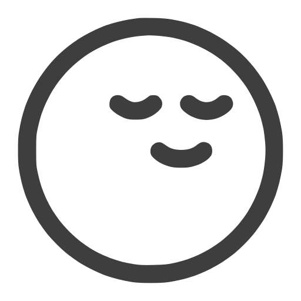

  
  <h1 align="center" style="display:inline">Odak.app</h1>

  <strong>Distraction-free Markdown writing app, fully offline and local-first.</strong> 
  <a href="https://odak.app">🌐 Try it online</a> | <a href="https://github.com/arazgholami/markdown-editor">Powered by WYSIWYG Markdown Editor</a>

  
  
  
  

---

## ✍️ About

**Odak.app** is a clean, minimalist, and privacy-respecting writing app with **live Markdown rendering**—built to keep you in the flow.  
No accounts, no ads, no cloud, and no distractions. Everything is stored locally on your device.

> Your thoughts deserve a focused space. Odak is it.

---

## 🚀 Features

- 🧘‍♂️ **Distraction-Free UI** – Auto-hides toolbars as you type, with optional nostalgic typewriter sounds
- 📝 **Live Markdown Support** – Create, edit, import, and export `.md` documents with real-time rendering
- 💾 **Local-First Storage** – All content is saved on your device; no internet or servers required
- 🌗 **Themes** – Switch between light, dark, and custom "Odak" theme for optimal writing comfort
- 🎨 **Custom UI** – Adjust font family, size, and editor width to your taste
- 🌐 **Multilingual** – Auto-detects RTL and LTR text for seamless international writing
- 🖼 **Backgrounds** – Add custom background images for personalized inspiration
- 💡 **Offline-Ready** – Works offline, with PWA support for installation on desktop or mobile

---

## 📷 Screenshot

---

## 🤝 Contributing

Pull requests and feedback are always welcome! Whether it's a typo fix or a major feature idea, your input is appreciated.

> ☕ Like it? Support development:
>  
> <a href="https://buymeacoffee.com/arazgholami">
>   
> </a>

---

## 📄 License

This project is licensed under the **MIT License**.

---

## 📬 Contact

**Araz Gholami**  
📧 Email: [contact@arazgholami.com](mailto:contact@arazgholami.com)  
🌍 Website: [arazgholami.com](https://arazgholami.com)
